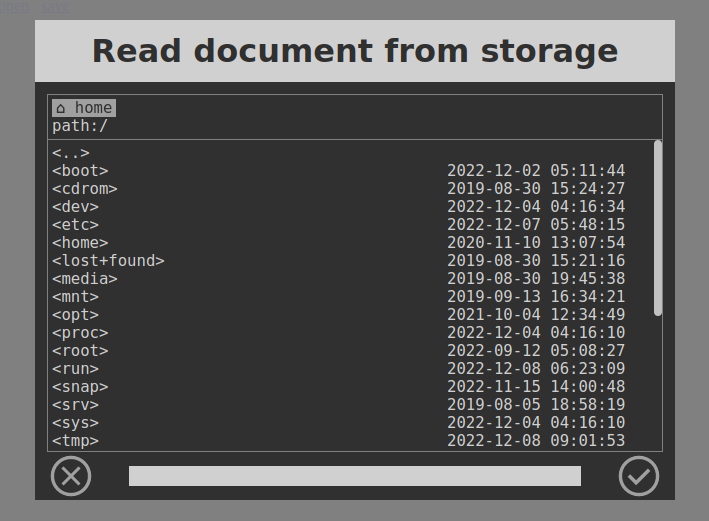

# file-picker.js

This is Node.js and HTML based minimalist open/save dialog operating on server filesystem.

The package has no external dependencies. To test it, run `node main.js` and point browser to localhost:8080.
